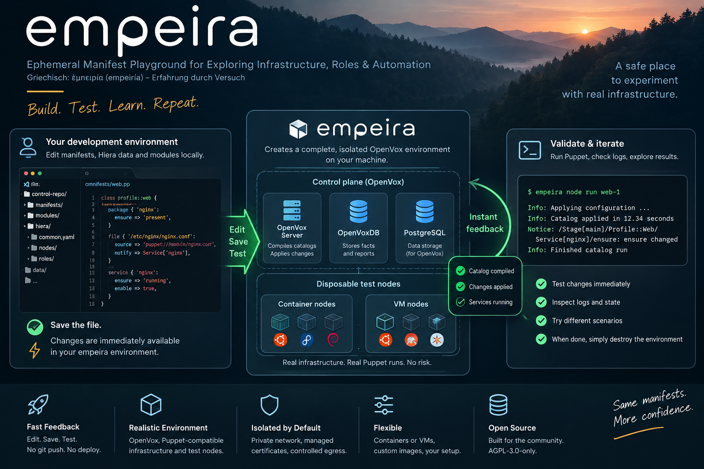

# empeira

**Ephemeral Manifest Playground for Exploring Infrastructure, Roles & Automation**

[](https://github.com/c8m6/empeira/actions/workflows/ci.yml)
[](https://github.com/c8m6/empeira/actions/workflows/openvox.yml)
[](https://github.com/c8m6/empeira/releases)
[](docs/installation.md)
[](LICENSE)

**ἐμπειρία (empeiría)** — experience gained through practice. The name reflects
learning about infrastructure by experimenting, testing and seeing what happens.

empeira gives your local Puppet control repository a disposable, isolated lab with
real agents, catalogs, Hiera and PuppetDB. Test infrastructure changes against an
OpenVox environment without connecting to production infrastructure.



## Edit. Save. Test.

**No Git push. No deployment.**

Edit your manifests, roles, modules or Hiera data locally. empeira works directly
with your development files, so there is no need to commit, push or deploy changes
before testing them. Run `empeira node puppet host1` on a disposable node to compile
a fresh catalog, apply it and see the results.

Saving a file does not start Puppet. Managed servers disable environment caching,
so the next catalog request reloads live code without a content scan or cache API call. Puppetfile changes
may require `empeira update modules`; `up` does not synchronize modules. See
[environment caching](docs/nodes.md#environment-cache-and-live-code) and
[Puppetfile modules](docs/hiera-and-eyaml.md#puppetfile-modules).

## Features

OpenVox Server, OpenVoxDB, PostgreSQL and OpenVox Agent are the defaults. Server and
database OCI images are independently replaceable; agent packages, versions and
signed repositories or verified package artifacts are selected separately.

- Docker or rootless Podman container nodes; accelerated QEMU VM nodes.
- A workspace CA, certificate enrollment, live control code and Hiera/EYAML mounts.
- Shared DNS and container/VM networking, isolated by default.
- Allowlisted HTTP/HTTPS proxy access and explicit TCP egress rules.
- Node stop/start/destroy, direct shell access and real SSH.
- An internal Chromium desktop and small additional infrastructure services.
- Explicit Puppetfile module and image updates.

Hosts: Linux, macOS and Windows through WSL2/Linux. Ruby 3.4 is the minimum;
Ruby 3.4 and 4.0 are supported; CI runs deterministic tests with both versions.
Podman with Netavark is the default; Docker requires a Linux engine 28+ with
isolated bridge support. VMs require usable KVM or HVF. Platform setup and
validation limits are in [installation](docs/installation.md).

## Installation

Until a release is available, install from source with Ruby, Bundler and Git:

```bash
git clone https://github.com/c8m6/empeira.git
cd empeira
bundle install
export EMPEIRA_SOURCE="$PWD"
empeira() { BUNDLE_GEMFILE="$EMPEIRA_SOURCE/Gemfile" bundle exec ruby "$EMPEIRA_SOURCE/bin/empeira" "$@"; }
empeira --version
```

The function lets you invoke the source CLI from your control repository. See
[installation](docs/installation.md) for runtime prerequisites, release-gem
installation and Bash completion.

## Quickstart

Use a dedicated Git control repository and an empty configuration marker:

```bash
cd ..
mkdir control-repo
cd control-repo
git init
touch .empeira.yaml
mkdir -p manifests
printf "file { '/tmp/empeira-example': content => 'managed by Puppet\n' }\n" > manifests/site.pp

empeira config validate
empeira up
empeira node run host1
empeira node puppet host1
empeira node shell host1
```

`node run` creates an Ubuntu 24.04 container, installs the default OpenVox Agent,
enrolls its certificate and applies the catalog. Inside the shell, inspect
`/tmp/empeira-example`; `exit` returns to the host. Select Docker with
`--container-engine docker` when Podman is not installed. Optional workstation
preferences can set that runtime in `~/.empeira.yaml`.

After editing your control code, run `empeira node puppet host1` again. If the
repository uses a Puppetfile, run `empeira update modules` before `up`.

```console
empeira status
empeira node list
empeira browser
empeira node destroy host1
empeira destroy
```

`destroy` permanently removes the workspace's owned nodes, CA and database data.
The control repository, module directory and shared image caches are preserved.

## Documentation

- [Configuration](docs/configuration.md): defaults, software selection and overrides.
- [Nodes](docs/nodes.md): lifecycle, shell/SSH, VM images and bootstrap.
- [Hiera and EYAML](docs/hiera-and-eyaml.md): local data mounts and Puppetfile modules.
- [Networking](docs/networking.md) and [proxy policy](docs/proxy.md).
- [Troubleshooting](docs/troubleshooting.md).
- [Architecture](docs/architecture.md) and [development](docs/development.md).

## Alpha status

empeira is being prepared for its first public alpha. Interfaces and inventory
schemas may change; unsupported inventory fails closed without automatic migration.
Use synthetic control code and disposable credentials. The shared network is a
cooperative lab, and its internal PuppetDB API is unauthenticated.

Container process mode does not provide a full booted OS. Systemd requires Podman
and cgroup v2. VM and shared-network support require actual host capabilities;
macOS/HVF and arm64 runtime validation are manual gates. Native Windows, automatic
self-update, aggregate `update all` and standalone platform binaries are unavailable.
The initial release distribution is a Ruby gem.

## Community and license

[Contributions](CONTRIBUTING.md), [issues](https://github.com/c8m6/empeira/issues)
and [pull requests](https://github.com/c8m6/empeira/pulls) are welcome. Follow the
[code of conduct](CODE_OF_CONDUCT.md) and report vulnerabilities through the
[security policy](SECURITY.md).

Project-owned code and documentation are licensed under
[AGPL-3.0-only](LICENSE). Third-party packages and images retain their own licenses
and notices and are obtained from upstream; empeira does not bundle them or
redistribute proprietary Puppet Enterprise software.
