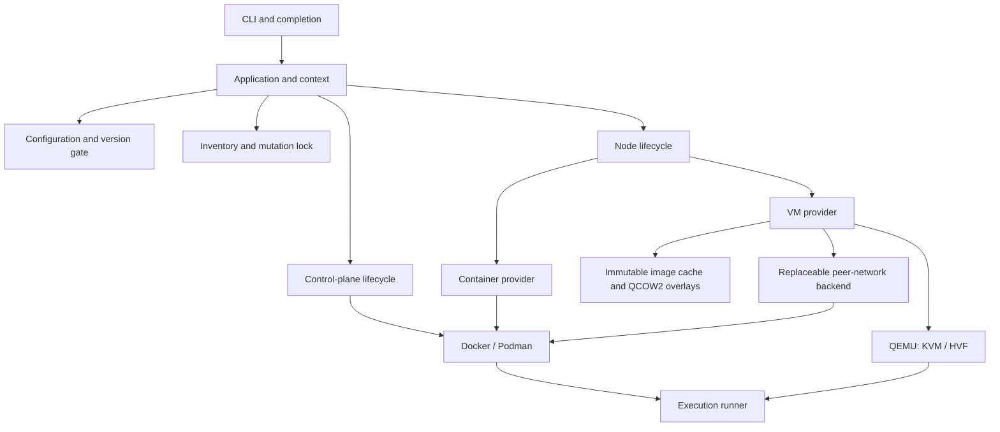

# Architecture

Empeira has one control-plane lifecycle and interchangeable infrastructure adapters.
The CLI presents output and calls `Application`; the core loads without Thor.
`Application` composes a canonical Git project, immutable effective configuration,
workspace identity, platform locations and the central execution runner. Constructing
it does not start infrastructure. Registries expose names without constructing providers.

## Software and provider boundaries

| Boundary | Responsibility |
| --- | --- |
| Configuration | Safe YAML, deep merge, complete-path validation and permitted overrides |
| Platform | Host capabilities, architecture, home, state/cache locations and DNS discovery |
| Container runtime | Owned OCI containers, networks, volumes, images and runtime transport |
| Server runtime | Validated startup, paths and semantic environment mapping |
| Node provider | Common identity, bootstrap, enrollment and lifecycle for `container` or `vm` |
| VM engine | QEMU process, acceleration, console and overlay lifecycle |
| Image source | Upstream metadata, integrity verification and immutable VM base images |
| Execution | Argument-array processes, timeouts, streaming and diagnostic redaction |

OpenVox is the default software. `images.server`, `images.puppetdb` and
`images.postgres` select OCI images independently. `server.runtime` and
`puppetdb.runtime` describe compatible startup contracts without classifying image
names. Agent selection is independent of those images. Container recipes add base
tools; managed bootstrap installs the agent, verifies cleanup and enrolls its
certificate before Puppet runs. Cloud-Init is a VM delivery mechanism only.

Nodes share lifecycle contracts: create rejects an existing name, stop preserves
state, start resumes it, and destroy removes owned state. Already satisfied lifecycle
operations return `changed: false`; absent start/stop and ownership conflicts fail.
Names are unique across both providers under the shared workspace transaction.
The only Empeira classification fact is `facts.empeira.provider`.

## Persistent state and ownership

| Location | Linux / WSL2 | macOS |
| --- | --- | --- |
| Cache | `$XDG_CACHE_HOME/empeira` or `~/.cache/empeira` | `~/Library/Caches/empeira` |
| State | `$XDG_STATE_HOME/empeira` or `~/.local/state/empeira` | `~/Library/Application Support/empeira` |
| Temporary work | Ruby `Dir.tmpdir` | Ruby `Dir.tmpdir` |

Relative XDG locations are ignored. Workspace identity hashes the canonical checkout
and user-home paths; moving a checkout changes its identity. Destroy needed resources
before moving it, or preserve its original path for cleanup.

`workspaces/ID/infrastructure.json` records the owning runtime, logical resources,
observed backend IDs, service/volume/node inventories, peer allocation and definition
fingerprints. Only the current schema is accepted. Atomic mode-0600 writes use
flush/fsync and rename. Invalid or unreadable state fails closed.

Resources carry `io.empeira.managed-by`, `io.empeira.workspace` and purpose labels.
Volumes also have a random identity label. Names alone never authorize adoption or
deletion. Mutations validate recorded IDs, labels and isolation, and persist creation
intent before changing runtime resources. Uncertain outcomes are inspected before
retry. Missing retained storage or database credentials never initialize replacement
data implicitly.

The runtime is authoritative for observed existence; inventory supplies ownership
and recovery context. Runtime migration is explicit: destroy with the owning engine,
then change configuration. `down` preserves CA and database storage; `destroy`
removes them. Both preserve control code, modules and caches.

All mutations share a nonblocking filesystem `flock` and version gate. Read-only
status takes no exclusive lock. The lock inode stays stable; never delete its file
as stale-lock recovery. Unsupported state has no automatic migration.

## Definitions and live code

Canonical SHA-256 fingerprints cover relevant managed definitions, independently
of application versions, YAML formatting and unrelated node defaults. Component
fingerprints allow selective service reconciliation while preserving owned storage.
Network changes and unsafe storage transitions require explicit lifecycle operations;
there are no implicit database-major migrations or automatic node replacements.

A separate environment-cache checkpoint tracks live control code, modules, Hiera
and server mounts. Changed content invalidates the selected environment through the
server's authenticated API without restarting it. Unchanged runs reuse loaded code
while still requesting fresh catalogs. See [nodes](nodes.md#environment-cache-and-live-code).

Command mocks use the same node inventory, generated-file mechanism and mutation
lock. They reconcile atomically before Puppet and during start/up, preserving
unchanged files and removing only verified owned stubs.

## Runtime and update planes

The control plane manages the server, database, DNS, workspace gateway and optional
proxy, browser and additional infrastructure services. Readiness probes test real
DNS, server, SQL and PuppetDB responses. Shared naming and peer backends preserve
container/VM connectivity and isolation. Network capabilities and isolation must
be verifiable; there is no host-network or software-emulation fallback.
See [networking](networking.md) for the privilege and trust boundaries.

`browser` validates existing infrastructure and reconciles only Chromium and its
fixed loopback UI relay. Additional services use ordinary ownership, DNS and
fingerprints, with a deliberately narrow configuration schema.

Updates form a separate plane. `update modules` uses host Git acquisition and a
disposable r10k helper; `update images` uses native registry metadata and cached
pulls/builds. Helpers use the runtime's normal bridge, require no infrastructure
inventory or workspace services, and are removed after each invocation. Git/SSH and
registry credentials remain owned by their native tools. `up` acquires missing
images only and never synchronizes modules. See [Hiera and modules](hiera-and-eyaml.md).

## Execution and secrets

All external processes use `Execution::Runner` with explicit arguments, environment,
directory and timeout. Capture and streaming share owned-process cleanup on Linux,
macOS and WSL2. Debug logs redact sensitive values; captured output is untrusted and
failure diagnostics are filtered and bounded. Interactive shell, SSH and console
operations suspend progress rendering.

Keys and generated credentials stay in private external workspace storage or owned
volumes. Agent repository credentials use only the two documented process variables;
bootstrap delivers them through temporary 0600 files and verifies their removal.
Repository/proxy credentials and private keys stay out of image layers, inventories,
fingerprints and public release assets.
