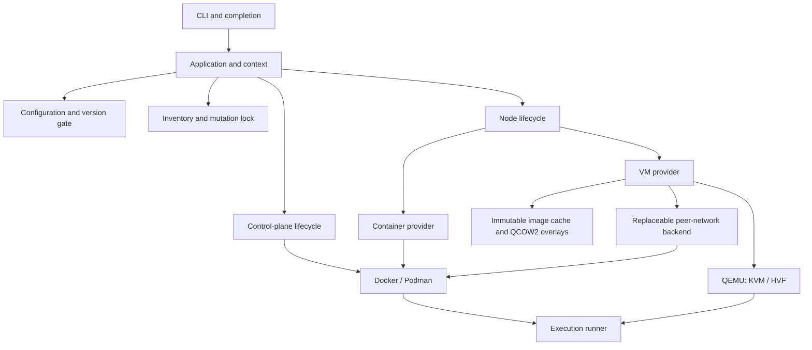

# Architecture

Empeira has one control-plane lifecycle and interchangeable infrastructure adapters.
The CLI presents output and calls `Application`; the core loads without Thor.
`Application` composes a canonical Git project, immutable effective configuration,
workspace identity, platform locations and the central execution runner. Constructing
it does not start infrastructure. Registries expose names without constructing providers.
The loader validates personal SSH preferences separately from the effective project
configuration. `Application` passes them only to the node-service login resolver;
that resolver selects user/identity fields for interactive SSH before dispatching
to the recorded provider. Internal VM transport retains its managed credentials.
A shared hostname-pattern helper supplies matching semantics without coupling SSH
preferences to proxy destination policy. Personal login values never enter context
configuration, definitions, fingerprints or inventory.

## Software and provider boundaries

| Boundary | Responsibility |
| --- | --- |
| Configuration | Safe YAML, deep merge, complete-path validation and permitted overrides |
| Platform | Host capabilities, architecture, home, state/cache locations and DNS discovery |
| Container runtime | Owned OCI containers, networks, volumes, images and runtime transport |
| Server runtime | Validated startup, paths and semantic environment mapping |
| Node provider | Common identity, bootstrap, enrollment and lifecycle for `container` or `vm` |
| VM engine | QEMU process, acceleration, console and overlay lifecycle |
| Image source | Upstream metadata, integrity verification and immutable VM base images |
| Execution | Argument-array processes, timeouts, streaming and diagnostic redaction |

VM interface rules resolve through Configuration using the shared hostname glob
matcher. The VM provider invokes the guest interface reconciler through its existing
management SSH channel after agent installation, on start/up and before managed
Puppet runs. Device intent and recovery definitions live in the locked node inventory;
atomically assigned locally administered MAC addresses and verified aliases bind
devices to workspace/node ownership. Guest observations establish device type,
parent, address and routes before mutation. The VM engine,
QEMU NIC topology, peer adapters and gateway policy remain independent of these
guest-only devices. See [interface lifecycle](nodes.md#additional-vm-interface-lifecycle).

OpenVox is the default software. `images.server`, `images.puppetdb` and
`images.postgres` select OCI images independently. `server.runtime` and
`puppetdb.runtime` describe compatible startup contracts without classifying image
names. Agent selection is independent of those images. Container recipes add base
tools. A shared agent acquisition component resolves native source metadata in an
owned, short-lived runtime helper, validates the package and publishes it atomically
in the user cache. Cache identity includes the native version, target and source.
Valid hits use local integrity and configured checksum checks and work offline,
including artifacts from authenticated sources. HTTP authentication and login occur
only during acquisition. Both node providers upload the same host artifact and
install it locally through native guest package managers. Bootstrap verifies cleanup
and enrolls certificates before Puppet runs. Cloud-Init is a VM delivery mechanism only.
VM disk preparation creates and resizes a private QCOW2 overlay, verifies its exact
backing image and configured virtual capacity, then publishes it atomically. The
immutable base is unchanged. First-boot readiness observes the actual mounted root
partition and filesystem after cloud-init growth, before managed package bootstrap.
Resume and workspace reconciliation preserve existing disk capacities.

Both providers reconcile normal guest proxy intent in the existing node inventory
after bootstrap cleanup. The shared reconciler uses the public control-plane
proxy environment, owned APT files and a bounded DNF block; provider transports
only execute guest operations. Managed Puppet receives explicit `env` arguments
inside the root guest command, preserving the runtime proxy policy.

Interactive tool PATH uses the same provider guest transports and node inventory.
Its startup fragments apply only to interactive Bash, with a small owned block
in the distribution's global initializer. Personal dotfiles and non-interactive
process environments stay under their existing owners.

VMs seed an independent root-only management daemon through Cloud-Init, with
private configuration, keys, runtime and service state. Its effective OpenSSH policy
requires public keys, disables password/keyboard-interactive authentication and PAM,
and binds only the existing isolated management endpoint. Every managed command
verifies this boundary, then directly enters the guest's normal mount namespace
without sudo. Root-owned private upload staging is hash-verified and cleaned up.
The user SSH adapter connects directly to the guest's peer IP through the owned
peer attachment, independently of management. Personal user/key/port resolution
applies only to `node ssh`; the default guest port is 22.
Existing peer adapters, ownership checks, session guards and network policy retain
their responsibilities. No external management port or host privilege is added.

The locked `empeira` system account and `/var/lib/empeira` home are seeded only for
regular interactive SSH, with a separate key and no sudo grant. Management never
validates or depends on that account or on system SSH/PAM/sudoers policy. Root and
the installed OpenSSH binary remain required guest facilities. A first-boot root
account lock is replaced by an impossible password hash when needed for key login;
configured console passwords are preserved. Old VM SSH layouts fail closed with an
explicit recreation diagnosis, without migration or automatic resource deletion.

Nodes share lifecycle contracts: create rejects an existing name, stop preserves
state, start resumes it, and destroy removes owned state. Already satisfied lifecycle
operations return `changed: false`; absent start/stop and ownership conflicts fail.
Names are unique across both providers under the shared workspace transaction.
The only Empeira classification fact is `facts.empeira.provider`.

## Persistent state and ownership

| Location | Linux / WSL2 | macOS |
| --- | --- | --- |
| Cache | `$XDG_CACHE_HOME/empeira` or `~/.cache/empeira` | `~/Library/Caches/empeira` |
| State | `$XDG_STATE_HOME/empeira` or `~/.local/state/empeira` | `~/Library/Application Support/empeira` |
| Temporary work | Ruby `Dir.tmpdir` | Ruby `Dir.tmpdir` |

Relative XDG locations are ignored. Workspace identity hashes the canonical checkout
and user-home paths; moving a checkout changes its identity. Destroy needed resources
before moving it, or preserve its original path for cleanup.

`workspaces/ID/infrastructure.json` records the owning runtime, logical resources,
observed backend IDs, service/volume/node inventories, peer allocation and definition
fingerprints. Only the current schema is accepted. Atomic mode-0600 writes use
flush/fsync and rename. Invalid or unreadable state fails closed.

Resources carry `io.empeira.managed-by`, `io.empeira.workspace` and purpose labels.
Volumes also have a random identity label. Names alone never authorize adoption or
deletion. Mutations validate recorded IDs, labels and isolation, and persist creation
intent before changing runtime resources. Uncertain outcomes are inspected before
retry. Missing retained storage or database credentials never initialize replacement
data implicitly.

The runtime is authoritative for observed existence; inventory supplies ownership
and recovery context. Runtime migration is explicit: destroy with the owning engine,
then change configuration. `down` preserves CA and database storage; `destroy`
removes them. Both preserve control code, modules and caches.

All mutations share a nonblocking filesystem `flock` and version gate. Read-only
status takes no exclusive lock. The lock inode stays stable; never delete its file
as stale-lock recovery. Unsupported state has no automatic migration.

## Definitions and live code

Canonical SHA-256 fingerprints cover relevant managed definitions, independently
of application versions, YAML formatting and unrelated node defaults. Component
fingerprints allow selective service reconciliation while preserving owned storage.
Each `up` batches service and volume observations and reuses them only within that
locked transaction. Starts, replacements and network attachments are inspected
again; destructive operations verify fresh ownership and recorded IDs. Later CLI
invocations never inherit these observations. Local image inspection results are
shared by availability, reviewed-recipe, ID and architecture checks within one
image-preparation block. A pull or build discards the old result before the new
image is inspected. `up` performs no remote freshness check or full image-content
hash; native image storage and immutable IDs remain the source of metadata.
A recorded container is inspected directly by ID; a missing ID falls back to
name inventory to detect replacements and renamed resources. DNS discovery uses the complete service observation and
one node snapshot, preserving unchanged generated files. Proxy allowlist changes
reload Squid after readiness without replacing its container; unchanged policy
and bindings do not trigger HUP. The existing inventory records a validated
proxy ID and small-file digest only after native reload success; failed reloads
are retried even if generated files are already current. Gateway lockdown is
reused only while the same instance remains locked in that transaction. Policy apply clears that checkpoint
before execution so every uncertain outcome attempts fresh lockdown. Firewall
policy and namespace routing are still reconciled on every `up`.
Node access verifies network ownership and isolation with one bounded native network inspection; membership counts are collected separately
for lifecycle observations and deletion, never inferred from the access check.
VM acquisition and restart still read the complete immutable base and verify its
SHA-256 pin, using the existing OpenSSL implementation. Neither file timestamps
nor cached fingerprints replace these integrity checks.
Network changes and unsafe storage transitions require explicit lifecycle operations;
there are no implicit database-major migrations or automatic node replacements.

Managed servers disable environment caching through native Puppet configuration
(`environment_timeout = 0` in `[server]`), applied by the startup wrapper before
the configured image entrypoint. `up` checks the actual native setting and restarts
only a server whose setting changed; it preserves every other configuration key
and retained storage. The configured Puppet confdir must agree with Puppetserver
HOCON `master-conf-dir`. Catalog
requests reload live code without repository hashes or environment-cache checkpoints.
See [nodes](nodes.md#environment-cache-and-live-code).

Command mocks use the same node inventory, generated-file mechanism and mutation
lock. They reconcile atomically during initial node provisioning and start/up, preserving
unchanged files and removing only verified owned stubs.

## Runtime and update planes

The control plane manages the server, database, DNS, workspace gateway and optional
proxy, browser and additional infrastructure services. Readiness probes test real
DNS, server, SQL and PuppetDB responses. Shared naming and peer backends preserve
container/VM connectivity and isolation. Network capabilities and isolation must
be verifiable; there is no host-network or software-emulation fallback.
See [networking](networking.md) for the privilege and trust boundaries.

`browser` validates existing infrastructure and reconciles only Chromium and its
fixed loopback UI relay. Additional services use ordinary ownership, DNS and
fingerprints, with a deliberately narrow configuration schema.

Exact DNS rewrites share the existing CoreDNS configuration and service-discovery
hosts file. Reloadable rewrite policy stays outside the DNS container definition
fingerprint, so `up` can reload it without invalidating container/VM resolver
bindings. Target lookups remain authoritative for `empeira.internal` and never
fall through externally. No separate DNS inventory or provider-specific state is
introduced. DNS image/definition replacement retains its existing node protection.

Transparent TCP redirects reuse the same gateway policy, fingerprint and discovery
boundary. Exact external source pairs are translated to observed internal services
with DNAT/SNAT; unresolved targets remain denied. Reconciliation blocks stale targets
before recreation and publishes their new addresses after service startup. Changed
NAT revokes namespace-local connection state while DROP is active. Unchanged rules
preserve connections and node identities. DNS and proxy policy are independent;
there is no additional service-IP inventory or provider-specific redirect plane.

Updates form a separate plane. `update modules` uses host Git acquisition and a
disposable r10k helper; `update images` uses native registry metadata and cached
pulls/builds. Helpers use the runtime's normal bridge, require no infrastructure
inventory or workspace services, and are removed after each invocation. Git/SSH and
registry credentials remain owned by their native tools. `up` acquires missing
images only and never synchronizes modules. See [Hiera and modules](hiera-and-eyaml.md).

## Execution and secrets

All external processes use `Execution::Runner` with explicit arguments, environment,
directory and timeout. Capture and streaming share owned-process cleanup on Linux,
macOS and WSL2. Debug logs redact sensitive values; captured output is untrusted and
failure diagnostics are filtered and bounded. Interactive shell, SSH and console
operations suspend progress rendering.

Keys and generated credentials stay in private external workspace storage or owned
volumes. Agent repository credentials use only the two documented process variables;
bootstrap delivers them through temporary 0600 files and verifies their removal.
Repository/proxy credentials and private keys stay out of image layers, inventories,
fingerprints and public release assets.
