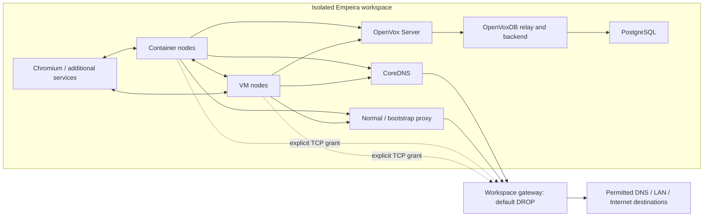

# Networking

Container and VM nodes share one isolated IPv4 peer network with logical DNS names
and arbitrary internal TCP/UDP. They have no unrestricted host-network or Internet
attachment. External traffic requires an explicit TCP grant or allowlisted proxy
policy. IPv6 is disabled; external UDP grants are unsupported.

VM-only [additional dummy/VLAN interfaces](configuration.md#additional-vm-interfaces)
exist entirely inside the guest. They provide ordinary Facter bindings without an
external VLAN attachment or changes to the peer/management NICs. Their connected
routes must avoid existing guest routes, the workspace and management subnets,
and transparent redirect source addresses. `/32` is preferred for isolated fact
tests. Empeira verifies and preserves default routes, and refuses foreign device
ownership or dependencies instead of removing them.



The workspace is a cooperative lab, not an adversarial tenant boundary. Privileged
peers can spoof shared-network identities. Engine administrators can inspect
containers and credentials. Use disposable test data and trusted guests.

## Logical network and backend resources

Docker uses an internal bridge with
[isolated gateway mode](https://docs.docker.com/engine/network/port-publishing/#gateway-modes).
Podman uses an internal Netavark bridge with isolation and runtime DNS disabled.
Empeira verifies ownership, driver and isolation before reuse; unsupported or
unverifiable capabilities fail closed.

| CLI host/runtime | VM peer attachment |
| --- | --- |
| Linux/WSL2, rootless Podman | Nonpersistent TAP in the rootless Netavark namespace |
| Linux/WSL2, Docker | Private QEMU Ethernet channel and owned bridge adapter |
| macOS, Podman Machine | QEMU channel through machine SSH and rootless TAP |
| macOS, Docker Desktop | QEMU channel through runtime exec and owned bridge adapter |

One backend factory owns this selection. No host route to container IPs is assumed
on macOS. KVM/HVF and platform-specific wiring require the corresponding
[manual gates](development.md#vm-and-shared-network-prerequisites).
Podman Machine needs one unambiguous active rootless connection and shared canonical
state paths; Empeira never resets the machine or falls back to rootful execution.

The static Go adapter is built from packaged source in an isolated, content-hashed
context by the selected runtime. Go is not a host prerequisite. Packet channels
use private directories/sockets outside the control repository. Adapter helpers
have no control-code mount or credentials; identity, definition and checksum are
verified. The VM management NIC has restricted loopback SSH only, separate from
peer application traffic, DNS and Puppet.

New VM layouts forward this same private endpoint to the dedicated management
daemon on 10.0.2.15:22222. System SSH uses a key-authenticated management tunnel
restricted to the VM's own peer IPv4 and selected guest port. There is no additional
host publication or network adapter. Management credentials and host keys are
independent of system SSH and personal preferences. Older VM layouts fail closed
and require explicit recreation. See [SSH layouts and recovery](nodes.md#shell-and-ssh).
Root management uses a private key and does not depend on the regular system SSH
account at `/var/lib/empeira`; it adds no listener, adapter, external publication or destination-policy exception.

The CLI host and engine may have different filesystems. Control/Hiera directories,
server mounts and state must be visible at their canonical paths. Mount probes
inspect visibility without writing markers. Remote-engine path translation is not
implemented. On WSL2, keep source checkouts on the Linux filesystem.

### Address lifetime and recovery

Under the workspace lock, Empeira selects an unused private /24 after checking
host routes and runtime networks. Gateway/DNS/proxy addresses, VM/container leases
and runtime infrastructure allocation use separate pools. There is no fixed global
subnet or user IP/MAC setting. Unknown overlap or ownership fails closed.

A node's IP, MAC and DNS record survive stop/start. Destroy releases its lease and
removes its record, transport and credentials; recreating a name need not reuse its
address. A later VPN route can require workspace recreation. Unsupported inventory
or definition revisions fail closed without migration or automatic adoption.

## One gateway, one direct-egress policy

Every peer uses the owned gateway as its IPv4 default route. Only the gateway has
an external uplink; DNS, proxies, server, database and nodes stay isolated.
The fixed browser UI relay has a separate loopback access path with forwarding off.

`network.egress` grants destination IPv4/TCP-port pairs:

```yaml
network:
  egress:
    - host: repository.example.net
      ports: [443]
    - ip: 203.0.113.10
      ports: [443, 8443]
```

Entries have exactly one `host` or `ip`. Hostnames match exactly, without wildcards;
`up` resolves every current A record and replaces the complete policy. IP selectors
bypass DNS and may intentionally permit private LAN/VPN destinations. A different
name sharing an allowed IP is reachable on that port: the firewall cannot distinguish
HTTP Host or TLS SNI. DNS changes require another `up`.

Reconciliation installs DROP before applying complete rules. Removed grants also
revoke existing connections. DNS or firewall failure leaves egress blocked/stopped,
never on unrestricted provider NAT. Policy edits preserve node/gateway identities;
`status` checks actual rules and forwarding, and `up` repairs drift.

CoreDNS alone receives TCP/UDP 53 to its selected resolvers. Proxies alone receive
TCP 80/443 and enforce their destination allowlists. Normal proxy allow rules apply
regardless of target IP range; the temporary authenticated bootstrap proxy retains
its separate private/reserved-address restrictions.
`proxy.global` does not grant direct egress. Applications choose DIRECT/proxy using
their own settings and `NO_PROXY`; direct/proxy selection has no automatic fallback.
Both explicit hostnames and IPv4 selectors from `network.egress` are included in
normal proxy bypass settings. The gateway still permits only their configured TCP ports.
See [proxy policy](proxy.md) for hostname rules and bootstrap destinations.

During bootstrap, a node is excluded from direct egress and normal proxy bindings.
A separate authenticated /32-source-bound proxy installs packages. Cleanup restores
package configuration, removes temporary access/credentials and activates final
runtime policy before enrollment and Puppet. Failed bootstrap stays incomplete.

Normal proxy settings are distinct from that temporary bootstrap transaction.
Managed Puppet processes receive matching uppercase/lowercase HTTP/HTTPS and
NO_PROXY variables inside the privileged guest command, including direct-root VM
management.
APT uses `/etc/apt/apt.conf.d/90-empeira-proxy`; DNF receives an owned block in
the existing `/etc/dnf/dnf.conf` `[main]` section. Direct-egress hosts get native
APT DIRECT entries unless an explicit host setting already exists. Foreign
host-specific APT settings and DNF repository overrides remain unchanged.
Conflicting global settings, modified owned files or unsafe paths fail with a
diagnosis. APT configurations using `#include`/`#clear` require explicit review.
DNF repository `proxy=` disables the inherited proxy; `_none_` retains DNF's
native curl environment semantics (see the [DNF reference](https://dnf.readthedocs.io/en/stable/conf_ref.html#proxy)).
These settings change client routing only; destination grants and isolation stay
under the existing gateway and proxy policies.

## Transparent TCP redirects

`network.redirects` maps exact original IPv4/TCP destination pairs to the current
address/port of an owned internal application service. Multiple pairs may share a
service. This supports fixed production endpoints such as PowerDNS APIs without
changing Puppet/Hiera or implementing application logic in Empeira. Configuration
and an example are in [configuration](configuration.md#transparent-tcp-redirects).

Container nodes, Puppet/OpenVox Server and internal services already route external
destinations through the workspace gateway. VM cloud-init installs the same default
route, and peer adapters transport Ethernet without introducing another IP router.
The browser UI relay and the gateway itself are infrastructure endpoints, outside
this source/target contract. Source addresses inside the workspace subnet or in
loopback, link-local, unspecified or multicast/reserved ranges are rejected because
those paths would bypass normal gateway routing.

The gateway applies exact DNAT in its private namespace. Since the destination and
client share a subnet, it also SNATs redirected flows to its internal address so
replies return through the same conntrack translation. The test service sees the
gateway as its TCP client; the original client sees the configured external endpoint.
TCP bytes are unchanged, including HTTP headers and bodies. TLS remains end to end
and the application must validate the original endpoint's certificate as usual.
This follows Netfilter's [same-network NAT guidance](https://www.netfilter.org/documentation/HOWTO/NAT-HOWTO-6.html).

Filtering accepts only the configured original pair and the observed internal
target pair in the appropriate direction. It drops other packets for that original
pair before DNS/proxy/direct-egress grants, so a missing target never falls back to
the external IP. Bootstrap nodes remain excluded. Target addresses come from the
existing ownership-checked runtime discovery, with no additional inventory mapping.
Before target recreation, the redirect is blocked; after services start, `up`
refreshes the policy using their current addresses. A target that exits or refuses
connections causes a connection failure. Removing a service still referenced by
configuration fails validation; remove its redirect as part of the same edit.

Reconciliation first installs DROP, installs changed NAT while forwarding is still
blocked, then clears conntrack only inside the owned gateway namespace and activates
the complete filter. Mapping changes therefore revoke old connections, including
previous connections to the original external destination. This also interrupts
other connections passing through that gateway; clients must reconnect. Identical
NAT on repeated `up` preserves connection state. Any apply/capability failure leaves
the gateway blocked/stopped. `status` checks complete filter/NAT rules and forwarding.
No host conntrack, foreign firewall or target container configuration is changed.

The same helper runs in the Linux engine for Docker, rootless Podman, Docker Desktop
and Podman Machine; QEMU peers use the existing adapters. Runtime isolation and
attachment requirements still apply. Custom `images.direct_egress` images must
implement `redirects-capability` (`tcp-redirects-v1`), the redirect plan and conntrack
invalidation; incompatible images fail explicitly. Native macOS requires execution
of the platform gates before claiming validation.

Redirects do not change DNS, proxy allowlists/environment, `NO_PROXY`, or bootstrap
grants. An application explicitly using a proxy initially connects to that proxy;
it still needs a proxy allowlist entry and receives no automatic direct exception.
Use application-specific DIRECT settings or `curl --noproxy '*'` for direct tests.

## Runtime attachment and privilege boundary

Normal Empeira operation requires no interactive sudo/root. One-time runtime,
TUN and accelerator setup can need administrator privileges.

Containers receive managed routes through short-lived helpers in their owned
network namespace and do not retain `NET_ADMIN`. Docker peer helpers have narrowly
scoped `NET_ADMIN` and `/dev/net/tun`, read-only filesystems and no new privileges.

Docker also requires a short-lived administrative helper in the engine Linux host
network namespace. It has `NET_ADMIN`/`NET_RAW` and installs only two exact owned
bridge/subnet rules: raw acceptance and same-bridge forwarding. It verifies network
labels/ID, bridge name and subnet first, changes no host routes/default policies,
never flushes firewall tables, and removes its exact rules before network deletion.
It mounts no host files, engine socket or PID namespace. This is a real privilege
boundary relying on Docker daemon authorization. Rootless Podman does not use it.
Docker iptables-nft/legacy interfaces are supported; unknown/native nftables-only
engines fail closed. Docker Desktop host-network helper restrictions require
actual platform validation.

Do not attach extra interfaces or restart gateways outside the managed lifecycle.
Cross-workspace subnets, namespaces and bridge rules are distinct, but this shared
network does not protect against a malicious privileged peer.

The gateway recipe uses official Ruby/Alpine and distribution iproute2/iptables
and [conntrack-tools](https://www.netfilter.org/projects/conntrack-tools/)
(Netfilter, GPL-2.0-or-later) packages. The connection tool is a separate executable
in the owned helper, with no host installation or new Ruby dependency. Go/Ruby,
image and package notices are preserved in built images; only
project-owned source/recipes are shipped in Empeira. See
[provenance](configuration.md#control-plane-images-and-provenance).

## DNS and service communication

CoreDNS owns `empeira.internal` service names and node hostnames. Unknown names in
that internal zone never forward externally. Other names use host-derived resolvers:

```yaml
dns:
  upstream:
    mode: host
    servers: []
```

Linux/WSL2 reads the host resolver configuration, including systemd-resolved's
upstream file when needed. macOS reads `scutil --dns` and keeps per-domain routes.
Unusable loopback/link-local resolvers fail with instructions for an explicit
reachable IPv4 override. There is no public fallback resolver.

```yaml
dns:
  upstream:
    mode: explicit
    servers: [10.20.30.53]
  additional_resolver: resolver.empeira.internal
```

The optional additional resolver is queried first for non-Empeira names; NXDOMAIN
or NODATA falls through to the existing upstream. It may be a DNS name or address
and need not be an Empeira service. `up` activates it after additional services
start. VPN/engine routing remains the host's responsibility; flat Linux resolver
files cannot represent every split-DNS route. AAAA queries return NODATA.

### Exact DNS rewrites

`dns.rewrites` redirects an exact external hostname to an enabled internal service:

```yaml
dns:
  rewrites:
    - from: ipam.example.net
      to: api-layer.empeira.internal
    - from: inventory.example.net
      to: api-layer.empeira.internal
```

Both container and VM nodes use the same CoreDNS policy. Sources are normalized
case-insensitively, with an optional trailing root dot. A rule matches only its
source: `child.ipam.example.net` still follows the normal resolver policy, including
host split-DNS routes and the optional additional resolver. Unknown internal names
and configured rewrite lookups never fall back to an external resolver.

CoreDNS uses an exact `rewrite name` rule and the existing authoritative hosts-file
discovery for `empeira.internal`. An A query returns the target service's current
IPv4 address under the original source name, with a one-second TTL. No CNAME record
is created: CNAME queries return NOERROR with no answers for a discovered target.
AAAA queries retain IPv4-only behavior and return NOERROR with no answers. If a
target temporarily has no discovery record, A/CNAME queries return SERVFAIL locally;
AAAA remains empty. `up` rejects targets absent from the enabled service plan.

Adding, changing or removing rules takes effect through `empeira up`, using the
existing Corefile reload and SIGUSR1. CoreDNS and existing nodes keep their
identities and resolver bindings. Hosts-file updates are polled every second, so
service-address changes do not require a CoreDNS restart. Client DNS caches may
delay observations until their cached records expire. Unchanged `up` is idempotent.
Changes to the DNS image or container definition still retain the existing
protection against DNS replacement while nodes exist.

An API Compatibility Layer can therefore simulate several production API names
through one additional service; see the [configuration example](configuration.md#dns-rewrites-for-internal-services).
Only DNS changes. The original HTTP Host, TLS SNI, protocol, port and certificate
checks remain the application's responsibility. Gateway grants and proxy allowlists
are unchanged; a client using an HTTP proxy remains subject to that proxy's policy.

The server is `server.empeira.internal:8140`. PostgreSQL and OpenVoxDB are internal,
with retained volumes and random private database credentials. Readiness verifies
real SQL and database-backed PuppetDB queries.

Puppet/OpenVox Server uses `https://puppetdb.empeira.internal:8081`; internal tools
use `http://puppetdb.empeira.internal:8080`. Both fixed relay listeners forward to
`puppetdb-backend.empeira.internal:8080`. The HTTPS relay has a workspace CA-issued
certificate for terminus compatibility; it does not authenticate clients.
**PuppetDB HTTP is deliberately unauthenticated within the isolated lab.** It is
never host-published; this is not a production deployment recommendation.
PostgreSQL transport TLS is not configured. Normal agent/server/CA TLS and disabled
global autosigning remain intact.

`down` retains CA/database volumes and generated credentials; `destroy` removes
owned persistent data. Missing recorded storage or credentials fails closed.
Preserve state and volumes together for recovery.

## Internal browser and additional services

After `up`, `browser` starts/reuses only Chromium and its fixed UI relay and prints
`https://127.0.0.1:<dynamic-port>/`. It does not start stopped infrastructure.
The relay carries TLS only to the observed browser's port 3001, accepts no arbitrary
forwarding target and disables IP forwarding. Chromium stays isolated and has no
Internet grant from enabling the node proxy; its profile is disposable.

Additional services receive `<name>.empeira.internal` and publish no host ports.
Use internal URLs in Chromium, for example
`http://openvoxview.empeira.internal:5000` or `http://host1:8080`. VM/container peers
are reachable directly at their logical names, with no application exposure matrix.
The UI is accessible to local users who can reach its loopback endpoint.

Image/module acquisition uses the separate [update plane](architecture.md#runtime-and-update-planes),
with native runtime networking and user proxy/registry settings. Those helpers
never join the workspace or start its DNS/proxy/services.
